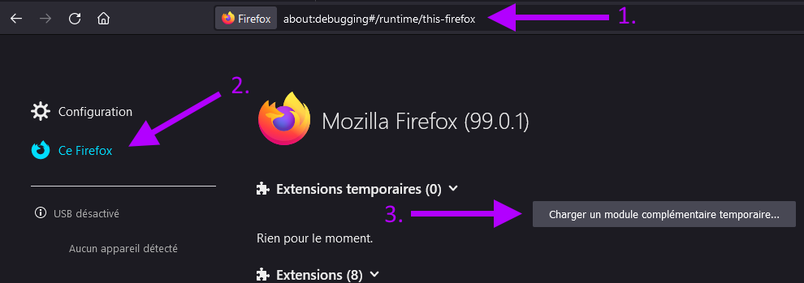
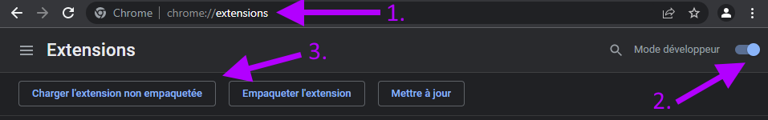

#  DescriCookie – Cookie descriptor!
This extensions list the cookies in the active tab and describe them with information from the [Open-Cookie-Database](https://github.com/jkwakman/Open-Cookie-Database).

## How to use
### Manually
1. Download the [latest release](https://github.com/hestiaAI/DescriCookie/releases/latest) of that repository.
2.  Firefox: While this extension is not signed and published, you cannot install it permanently (cf. [#1](https://github.com/hestiaAI/DescriCookie/issues/1)). For now:
    1. Extract the previously downloaded ZIP.
    2. In Firefox, open a new tab, and go to `about:debugging#/runtime/this-firefox`.
    3. Click on "Load Temporary Add-on button".
    4. In the previously extracted folder, select the file `manifest.json`.
    
4.  Chrome: Needs to be tested, cf. [#4](https://github.com/hestiaAI/DescriCookie/issues/4)). For now:
    1. Extract the previously downloaded ZIP.
    2. In Chrome, open a new tab, and go to `chrome://extensions/`.
    3. Enable "Developer mode".
    4. Click on "Load Unpacked".
    5. Go in the previously extracted folder to select it.
    

## Credits
- Cookie descriptions from [Open-Cookie-Database](https://github.com/jkwakman/Open-Cookie-Database).
- Squeleton for the project from [webextensions-examples](https://github.com/mdn/webextensions-examples).
- Example of [Papa Parse](https://www.papaparse.com/) from [Reading csv file using JavaScript and HTML5](https://www.js-tutorials.com/javascript-tutorial/reading-csv-file-using-javascript-html5/).
- Icon from [Game-icons.net](https://game-icons.net/) and a little bit of magic.
